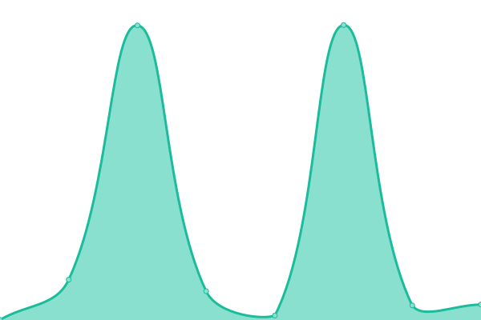

# [📈 Live Status](https://HipyCas.github.io/status): <!--live status--> **🟩 All systems operational**

This repository contains the open-source uptime monitor and status page for [HipyCas](hipycas.github.io), powered by [Upptime](https://github.com/upptime/upptime).

With [Upptime](https://upptime.js.org), you can get your own unlimited and free uptime monitor and status page, powered entirely by a GitHub repository. We use [Issues](https://github.com/HipyCas/status/issues) as incident reports, [Actions](https://github.com/HipyCas/status/actions) as uptime monitors, and [Pages](https://HipyCas.github.io/status) for the status page.

<!--start: status pages-->
<!-- This summary is generated by Upptime (https://github.com/upptime/upptime) -->
<!-- Do not edit this manually, your changes will be overwritten -->
<!-- prettier-ignore -->
| URL | Status | History | Response Time | Uptime |
| --- | ------ | ------- | ------------- | ------ |
|  [Be3 Dashboard](https://be3-dashboard-web.web.app) | 🟩 Up | [be3-dashboard.yml](https://github.com/HipyCas/status/commits/HEAD/history/be3-dashboard.yml) | 

 89ms
     
 | 

<a href="https://HipyCas.github.io/status/history/be3-dashboard">100.00%</a>
    

|  [Tindefc (Netlify)](https://tindefc.netlify.app) | 🟩 Up | [tindefc-netlify.yml](https://github.com/HipyCas/status/commits/HEAD/history/tindefc-netlify.yml) | 

 259ms
     
 | 

<a href="https://HipyCas.github.io/status/history/tindefc-netlify">100.00%</a>
    

|  [TCP ping](1.1.1.1) | 🟩 Up | [tcp-ping.yml](https://github.com/HipyCas/status/commits/HEAD/history/tcp-ping.yml) | 

 62ms
     
 | 

<a href="https://HipyCas.github.io/status/history/tcp-ping">100.00%</a>
    

<!--end: status pages-->

[**Visit our status website →**](https://HipyCas.github.io/status)

## 📄 License

- Powered by: [Upptime](https://github.com/upptime/upptime)
- Code: [MIT](./LICENSE) © [HipyCas](hipycas.github.io)
- Data in the `./history` directory: [Open Database License](https://opendatacommons.org/licenses/odbl/1-0/)
